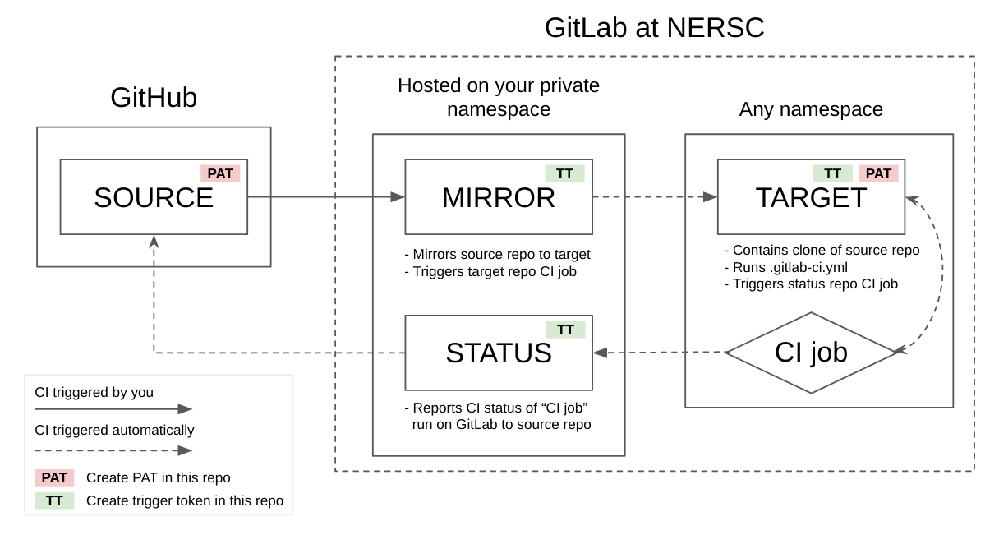
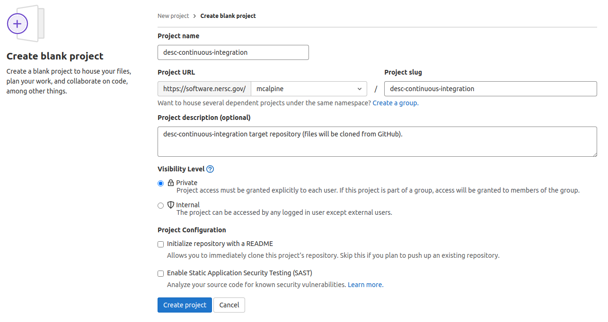
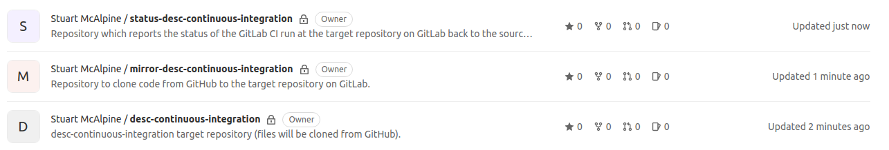
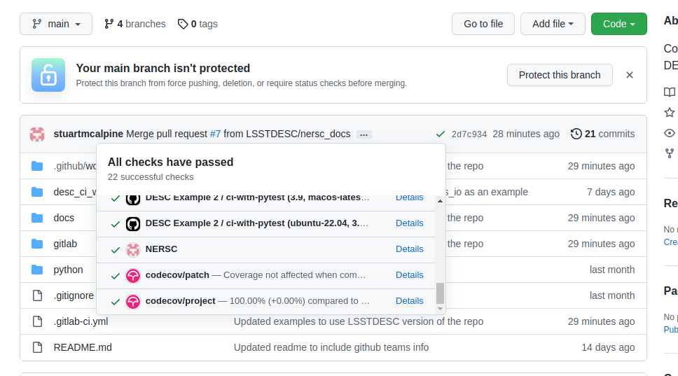

CI at NERSC using GitLab
========================

For the majority of cases the self-hosted runners provided by *GitHub* will be
more than sufficient to test and maintain code stability for DESC repositories.

However, there are some pieces of DESC software that would benefit greatly from
having the ability to deploy a CI workflow directly to the *Cori* and
*Perlmutter* machines at `NERSC <https://www.nersc.gov/>`__. This would allow
the software to be tested more intensely within an HPC environment, give access
to specific development tools at *NERSC*, and give the ability to test the code
against the large datasets hosted at the facility, for example.

As there is no way to link CI workflows using *GitHub Actions* to the *NERSC*
facilities directly, we require a bit of a workaround. Starting with our
``source`` repository on *GitHub*, we need to create three additional
supporting repositories at the `NERSC GitLab instance
<https://software.nersc.gov/>`__ (where we have direct access to the *Cori* and
*Perlmutter* machines).

#. A ``mirror`` repository, which clones the contents of the *GitHub*
   ``source`` repository to a ``target`` repository at *GitLab*.

#. A ``target`` repository, which performs the actual CI using *GitLab*'s
   builtin CI tools (similar to *GitHub Actions*).

#. A ``status`` repository, which reports the results of the CI workflow
   performed at the ``target`` repository back to the *GitHub* ``source``
   repository.

This means there is a bit of manual setup required in order to perform CI at
*NERSC* when starting from a *GitHub* repository, however once setup, the
process is fully automated.

   Figure 1: Schematic of the three stages of the process described above.

Here we go over the steps required to implement a CI workflow at *NERSC*
starting from a *GitHub* repository. For our `demo repositories'
<https://github.com/LSSTDESC/desc-continuous-integration>`__ example workflow,
the goal is the same as before, to trigger the repositories' test suite when
changes to the repositories' codebase are made.  The difference now being that
these tests will be performed directly on *Cori*, and not on a *GitHub
Actions*-hosted runner.

Much of this tutorial/example is templated from the `CI at NERSC documentation
<https://docs.nersc.gov/services/gitlab/>`__ and the `CI at NERSC tutorial
<https://software.nersc.gov/ci-resources>`__, which we also recommend looking
at.

.. note:: You will need a *NERSC* account and access to the `NERSC GitLab
   instance <https://software.nersc.gov/>`__ before moving forward. See `here
   <https://confluence.slac.stanford.edu/display/LSSTDESC/Getting+a+NERSC+Computing+Account>`__
   for details on how DESC members get an account at *NERSC*.

.. note:: The ``SCHEDULER_PARAMETERS`` (in the ``mirror`` and ``status``
   repositories' `.gitlab-ci.yml` files) define the compute node allocation
   options for submitting to *Cori*, which must be included. You can change
   this for your needs, for example to charge against a specific *NERSC*
   project, or change the resouces requested.

Getting set up
--------------

To start, you'll need to create three repositories at your *NERSC* *GitLab*
instance:

#. A blank (*"New Project -> Create Blank Project"*) ``target`` repository
   with the same name as the *GitHub* ``source`` repository (e.g,
   ``desc-continuous-integration``). This can be created in any
   namespace/group.  The eventual CI workflow is performed here, therefore
   those needing access to the CI logs should have this repository visible to
   them.

#. An imported (*"New Project -> Import Project -> GitLab Export*") ``mirror``
   repository with a name like ``mirror-desc-continuous-integration``. This
   repository must be created in your private namespace. The *GitLab* export
   file to use is in the `demo repository
   <https://github.com/LSSTDESC/desc-continuous-integration>`__ under
   ``./examples/nersc_gitlab/repo_templates/``.

#. An imported (*"New Project -> Import Project -> GitLab Export*") ``status``
   repository with a name like ``status-desc-continuous-integration``. This
   repository must be created in your private namespace. The *GitLab* export
   file to use is in the `demo repository
   <https://github.com/LSSTDESC/desc-continuous-integration>`__ under
   ``./examples/nersc_gitlab/repo_templates/``.

	Figure 2: Example of creating a blank repository on GitLab.

	Figure 3: At the end you should have three repositories on GitLab.

For those interested in the inner workings of the ``mirror`` and ``status``
repositories, have a look at :ref:`nersc-ci-appendix` in the Appendix.

Personal Access tokens
^^^^^^^^^^^^^^^^^^^^^^

Personal access tokens (PATs) are an alternative to using passwords for
authentication to *GitHub* or *GitLab* when using the API or the command line.
We need to set up PATs between our repositories in order for them to
communicate securely through our CI pipeline.

#. In the *GitHub* ``source`` repository, in your user profile, go to *Settings
   -> Developer settings -> Personal Access Tokens -> Generate New Token*. Name
   the PAT "*NERSC* CI", tick "workflow", and generate the token.  Copy the
   generated PAT and add it as a CI/CD variable in the ``mirror`` repository
   called ``MIRROR_SOURCE_PAT`` (*Settings -> CI/CD -> Variables*). Now add the
   same PAT as a CI/CD variable to the ``status`` repository called
   ``STATUS_TARGET_PAT`` (make sure to tick "masked" when adding both
   variables).

#. In the *GitLab* ``target`` repository, create a PAT by going to *Settings ->
   Access Tokens*. Name the token "mirror-repo", chose an expiration date,
   chose the role "Maintainer", and tick all four checkboxes.  Generate the
   token, and add it as a CI/CD variable in the ``mirror`` repository named
   ``MIRROR_TARGET_PAT``. Now add the same PAT as a CI/CD variable to the
   ``status`` repository called ``STATUS_SOURCE_PAT`` (again, make sure to tick
   masked for each). 

.. note:: The reason the ``mirror`` and ``status`` repositories should be
   created in your private namespace, so only you have access, is to protect
   the PATs stored within them. Do not share these tokens with anyone, this is
   the equivalent of password sharing.

.. note:: Always mask PATs stored as CI/CD variables. This prevents them from
   being displayed within the CI workflow output.

.. note:: PATs can have an expiration date, you may have to periodically create
   new PATs.

Trigger tokens
^^^^^^^^^^^^^^

In order for our CI pipeline to work seamlessly behind the scenes, we want the
various CI workflows for each intermediate repository to trigger automatically
when the previous one completes.  This is done through "Trigger Tokens", which
allow us to remotely trigger CI workflows within our repositories from an
external source. 

#. In the ``mirror`` repository, go to *Settings -> CI/CD -> Pipeline triggers*
   and create a trigger token with the description "trigger-from-github".  Copy
   the created trigger token and add it as a *Secret* called
   ``MIRROR_TRIGGER_TOKEN`` in the ``source`` repository on GitHub (*Settings
   -> Secrets -> Actions*).

#. Go to the ``target`` repository and create a trigger token called
   "trigger-from-mirror". Add this one to the ``mirror`` repository as a CI/CD
   variable called ``TARGET_TRIGGER_TOKEN``.

#. Go to the ``status`` repository and create a trigger token called 
   "trigger-from-target". Add this one to the ``target`` repository as a CI/CD
   variable called ``STATUS_TRIGGER_TOKEN``.

.. note:: Trigger tokens do not expire, but be sure to keep the variables masked.

Triggering the CI workflow pipeline from GitHub
^^^^^^^^^^^^^^^^^^^^^^^^^^^^^^^^^^^^^^^^^^^^^^^

The final file to create is a *GitHub Actions* CI workflow to initiate the
pipeline in the ``source`` repository.

The ``ci_nersc_template.yml`` workflow in ``.github/workflows/`` from our our
`demo repository <https://github.com/LSSTDESC/desc-continuous-integration>`__
gives a good example of how to do this. Note we need to pass all the
environment variables we will work with in the subsequent CI workflows of the
pipeline, which must be defined in the initial *GitHub Actions* workflow file.

Essentially, all we are doing is kick-starting the pipeline (in this example
manually) by initiating the ``mirror`` repositories CI workflow. You can
trigger the pipeline however you wish, however remember the examples in this
tutorial only work for a single chosen branch of the repository, and that each
trigger will run a full CI job at *NERSC*.

You must modify the repository URLs and *GitLab* project numbers (found under
*Settings -> General* in *GitLab*) in the template workflow to your own. 

.. literalinclude:: ../../../.github/workflows/ci_nersc_template.yml
   :language: yaml
   :linenos:
   :caption: ci_nersc_template.yml

Building a GitLab CI workflow for your repository
-------------------------------------------------

Now that we are set up, we can think about how to implement a CI workflow at
GitLab. As mentioned previously, the CI workflows for GitLab are placed in a
file called ``.gitlab-ci.yml``, which is located in the root directory of your
repository.  Here we will cover how to build a basic CI workflow with GitLab,
relating back to the GitHub Actions syntax we learned previously. A more
in-depth look at GitLab's CI syntax can be found in `The Complete GitLab CI
Reference Guide <https://docs.gitlab.com/ee/ci/yaml/>`__.

.. literalinclude:: ../../../.gitlab-ci.yml
   :language: yaml
   :linenos:
   :caption: .gitlab-ci.yml

This is the GitLab CI workflow for our example repository that will eventually
get run by the ``target`` repository on the *NERSC* GitLab instance. There are
many similarities with the GitHub Actions CI workflow syntax. We must tell the
workflow how to be triggered (same as ``on:`` in GitHub Actions), which is
under ``workflow:`` ``rules:``. In this case we are saying we only want the
workflow to run if it was triggered via a trigger token (see the reference
guide linked above for a full list of workflow options). We can set environment
variables for the job, under ``variables:``. And then we list our jobs.

As with GitHub Actions, we can have multiple jobs, each will run independently
and in parallel unless you deliberately link them. This workflow only has one
job, ``example``. Within each job, ``tagsi:`` is the same as ``runs-on:`` from
GitHub Actions. Here we want to run on *Cori*. And ``script:`` contains the
sequence of commands to execute for the job, the same as ``steps:`` from GitHub
Actions. 

When running at *NERSC* you have to set the ``SCHEDULER_PARAMETERS`` environment
variable, which defines your queue preferences for the machine (which queue to
submit to, which project to charge, etc). For more details about this, and
other specifics of running CI at *NERSC*, see `here
<https://docs.nersc.gov/services/gitlab/>`__. Example repositories from *NERSC*
for CI can also be found `here <https://software.nersc.gov/ci-resources>`__.

When everything has finished successfully, you should see the *NERSC* CI status
beside the commit on the GitHub repository main page. Clicking its "details"
will take you to the GitLab CI report for the job.

    Figure 4: The *NERSC* tag is the reported status from the *NERSC* CI job.

Things to think about with CI at *NERSC*
----------------------------------------

.. note:: When deploying a CI workflow to *Cori* you are running code in the
   same environment, with the same permissions, as if you were working on a
   login node. Therefore things like ``$HOME`` refer to your real home
   directory, and you need to be careful about what scope your give to your CI
   workflows at *NERSC*.  As the developer, you are responsible for the code that
   is run, and you need to fully understand what is happening in the workflow
   that you are implementing.

.. note:: It is not recommended that you mirror code that you yourself do not
   own, unless they are from protected branches.

.. note:: Any code you mirror onto the *NERSC* GitLab instance must adhere to the
   broader `NERSC user policies <https://www.nersc.gov/users/policies/>`__.
